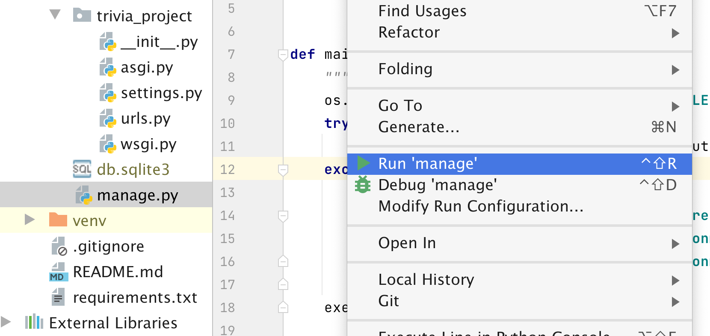
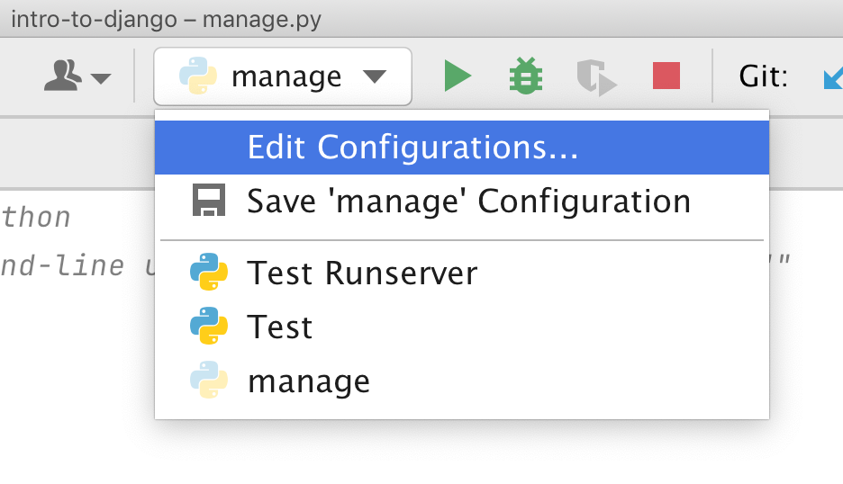
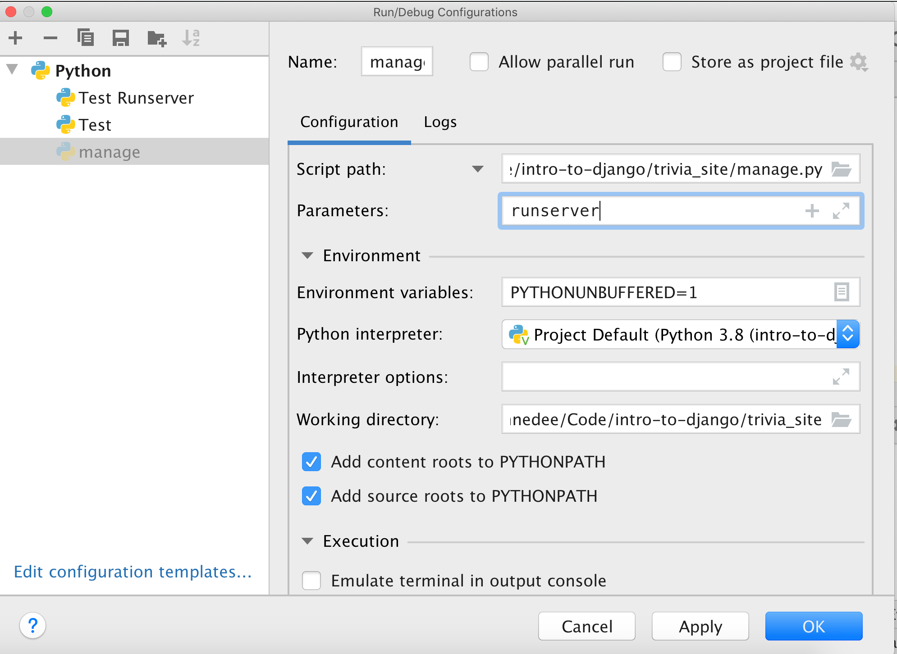
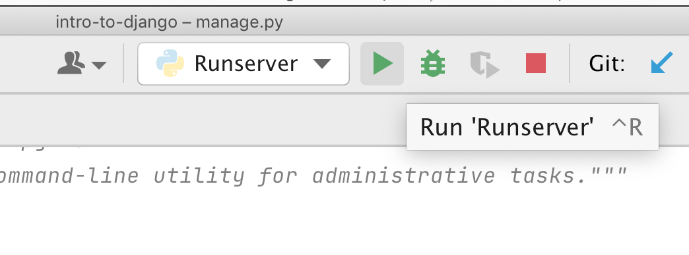
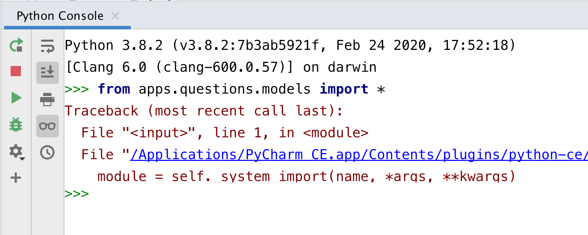
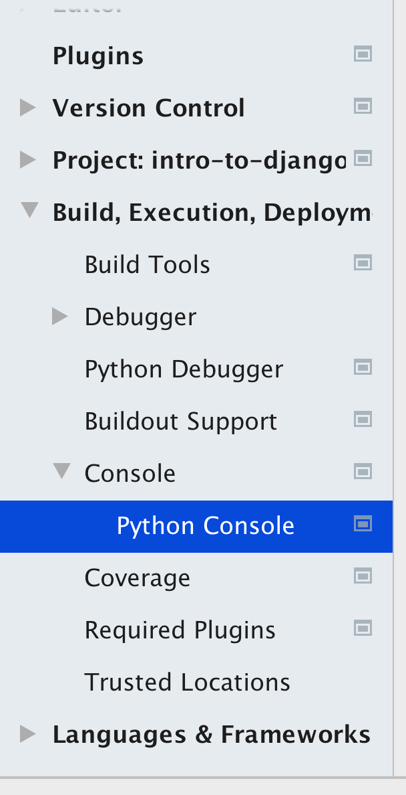
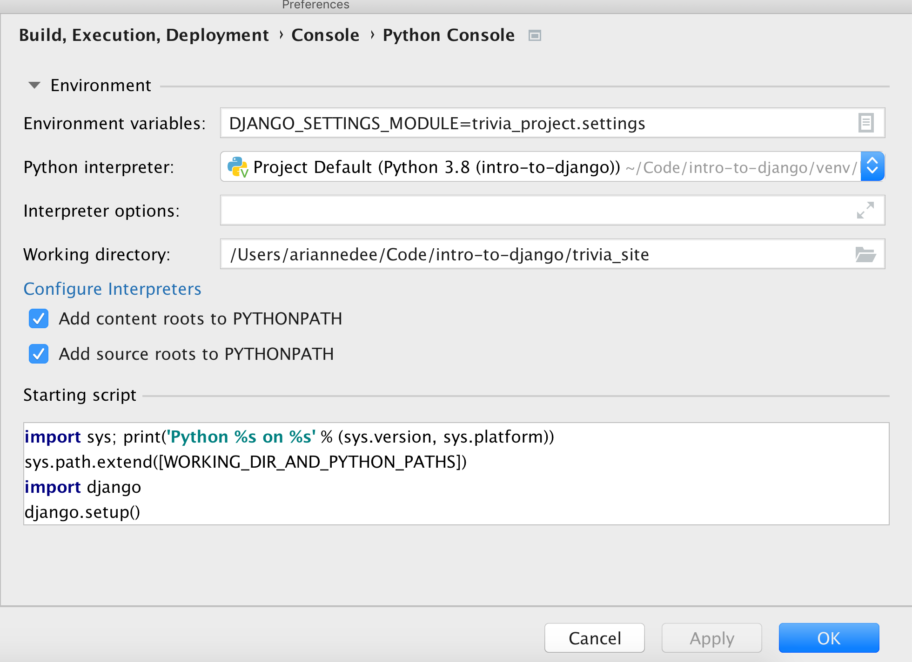

# Setting up Django in PyCharm Community
- [Linking your virtual environment](#linking-your-virtual-environment)
- [Running the `manage.py` development server](#running-the-managepy-development-server)
- [Run Django in the Python Console](#run-django-in-the-python-console)

## Linking your virtual environment
Follow the instructions here: [PyCharm virtual environment setup](PyCharm_venv.md)

## Running the `manage.py` development server
1. Open `manage.py`, right click, and select **Run 'manage'**
   

   
2. In the top bar, click on the run-configuration dropdown and select **Edit Configurations...**
   


3. In the **parameters** textbox, add "runserver"
   
Also edit the name at the top, to "Runserver", so it's more descriptive



4. Now you can select Runserver at the top and either Run or Debug
   


## Run Django in the Python Console
1. Open your Python Console

2. Try to import some models:
    `from apps.questions.models import *`
   


3. You'll get an error, like `django.core.exceptions.AppRegistryNotReady: Apps aren't loaded yet.`
    This is because Django has not been configured to run in your Python Console
   
4. Open the PyCharm settings
   


5. Go to **Build, Execution, Deployment** > **Console** > **Python Console**



6. Configure the console to run Django
  - Set the `DJANGO_SETTINGS_MODULE` **environment variable** to your project `settings.py` file's dotted path
  - Set the **Python interpreter** to your virtual environment's Python executable (if it's not already set properly)
  - Set the **working directory** to the folder that your `manage.py` file is in
  - In the **Starting script** area, add to the bottom of the existing code:
  ```python
import django
django.setup() 
```



7. Rerun the Python Console. Your model imports should work!

## Debugging
