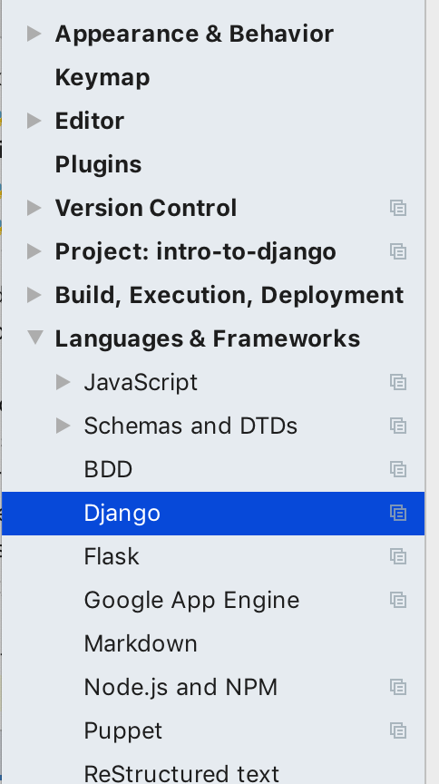
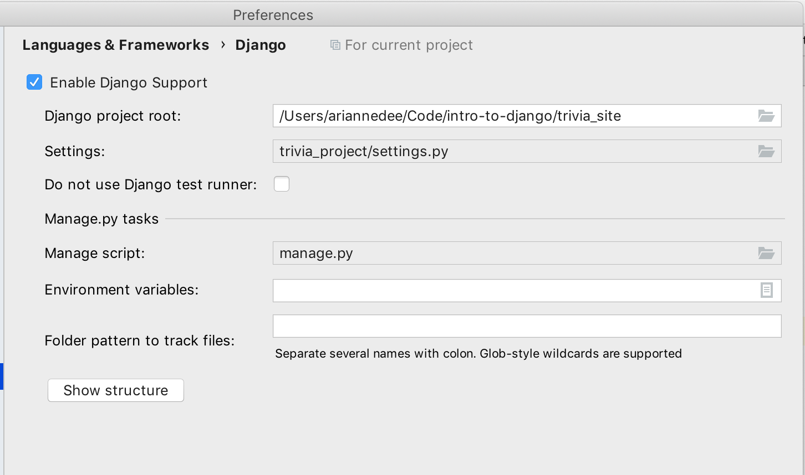
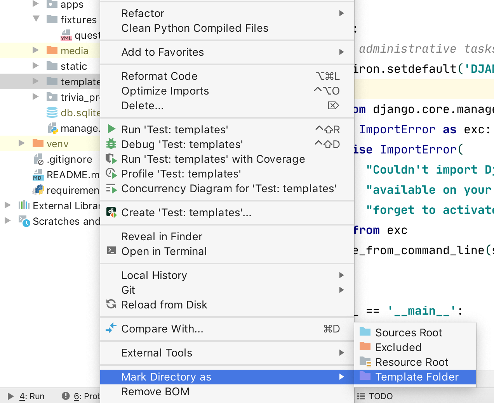
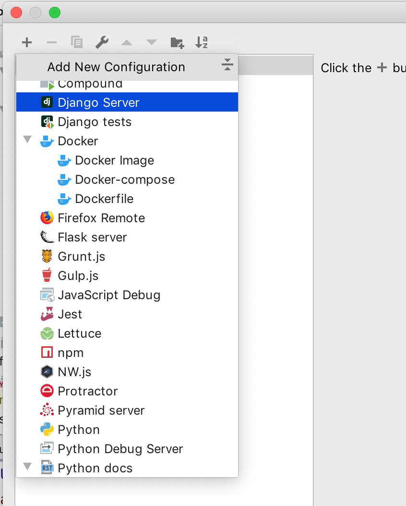
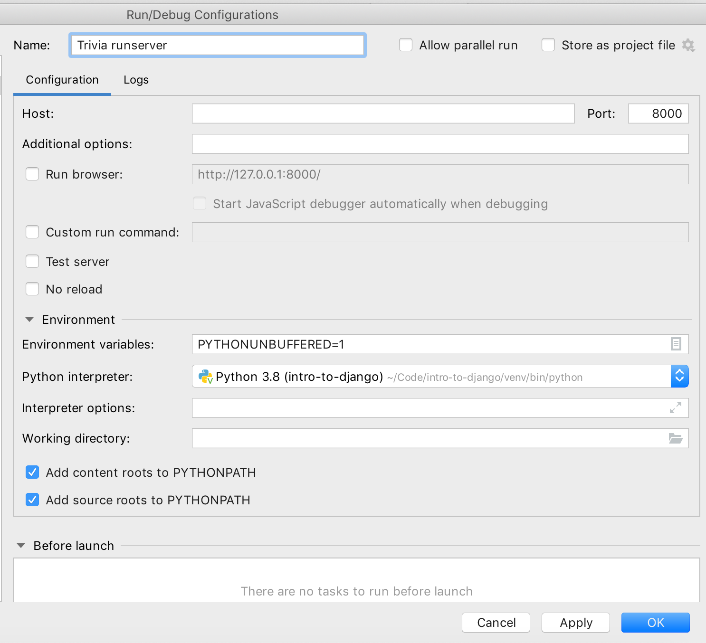
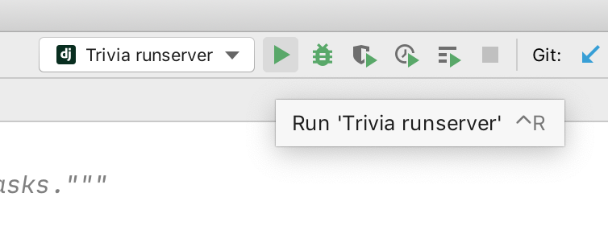
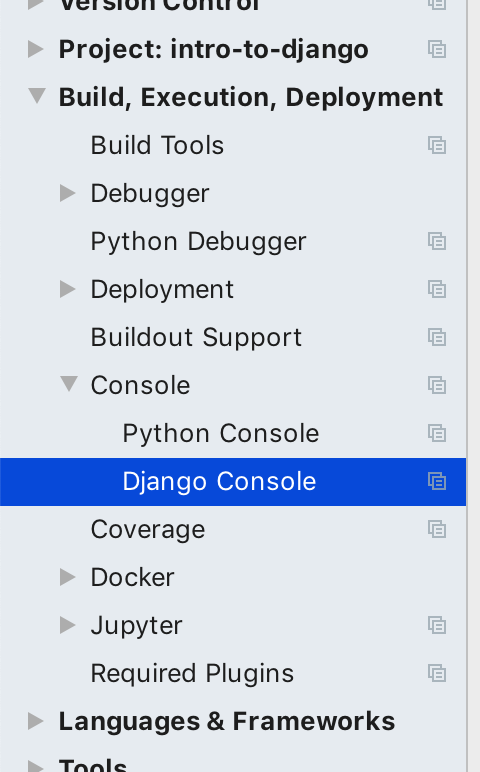
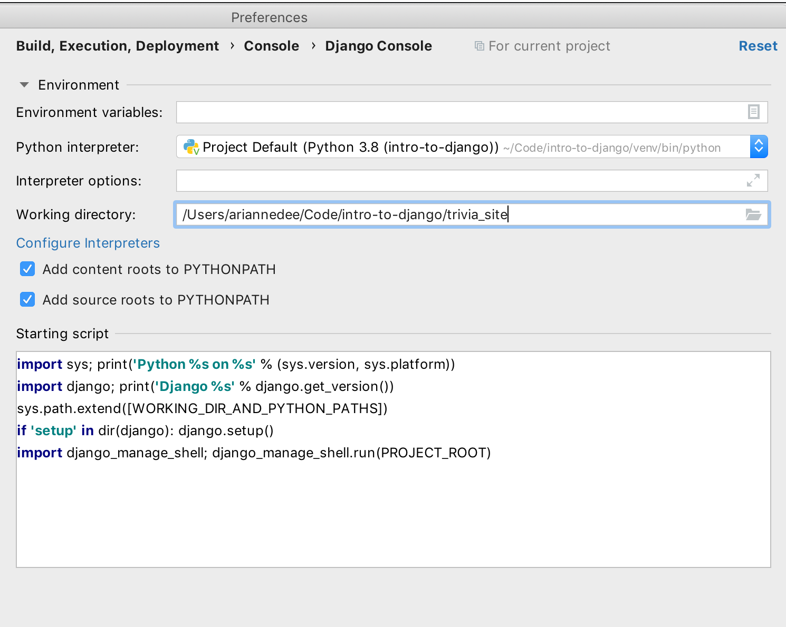

# Setting up Django in PyCharm Pro
- [Linking your virtual environment](#linking-your-virtual-environment)
- [Configure Django's project structure](#configure-djangos-project-structure)
- [Running the `manage.py` development server](#running-the-managepy-development-server)
- [Run Django in the Python Console](#run-django-in-the-python-console)
- [Debugging](#debugging)

## Linking your virtual environment
Follow the instructions here: [PyCharm virtual environment setup](PyCharm_venv.md)

## Configure Django's project structure

1. Open PyCharm's settings
   

2. Navigate to **Languages & Frameworks** > **Django**

3. Enable Django support and configure settings
- Select the **Django project root**, the folder that `manage.py` is in
- Select the **settings** file
- Select the **manage script**

4. Configure project folders
- Mark the `templates` folder as a **Template folder** (right click on folder > Mark Directory as)
- Mark `venv`, `media`, `.vscode`, and `.idea` as **Excluded**, so those files don't get searched as part of your "project"
- Mark `trivia_site` as **Sources Root** (not needed if your workspace root is the same as your project root folder)

## Running the `manage.py` development server
1. Open the run configuration view

2. Create a new Django config

3. Name it and add any further configurations you want (defaults will work)

4. Now you can run the server from the top nav bar

## Run Django in the Python Console
1. Open your Python Console

2. Try to import some models:
   `from apps.questions.models import *`

3. If you get an error, like `django.core.exceptions.AppRegistryNotReady: Apps aren't loaded yet.`
   then you need to configure the Django Console

4. Open the PyCharm settings

5. Go to **Build, Execution, Deployment** > **Console** > **Django Console**

6. Configure the Django console
- Set the **Python interpreter** to your virtual environment's Python executable (if it's not already set properly)
- Set the **working directory** to the folder that your `manage.py` file is in

7. Rerun the Python Console. Your model imports should work!

## Debugging
Follow the instructions for [configuring runserver in the run settings](#running-the-managepy-development-server).

Once you've done that, you can run it in **Debug** mode.

Breakpoints can be set in:
- your Python code
- any external library code (like Django internals)
- template tags in your templates
