# Setting up Django in PyCharm Community
- [Installing extensions](#installing-extensions)
- [Linking your virtual environment](#linking-your-virtual-environment)
- [Configure run settings](#set-up-a-run-configuration-file)
- [Debugging](#debugging)

## Installing extensions

Make sure you have the Python extension by Microsoft.

   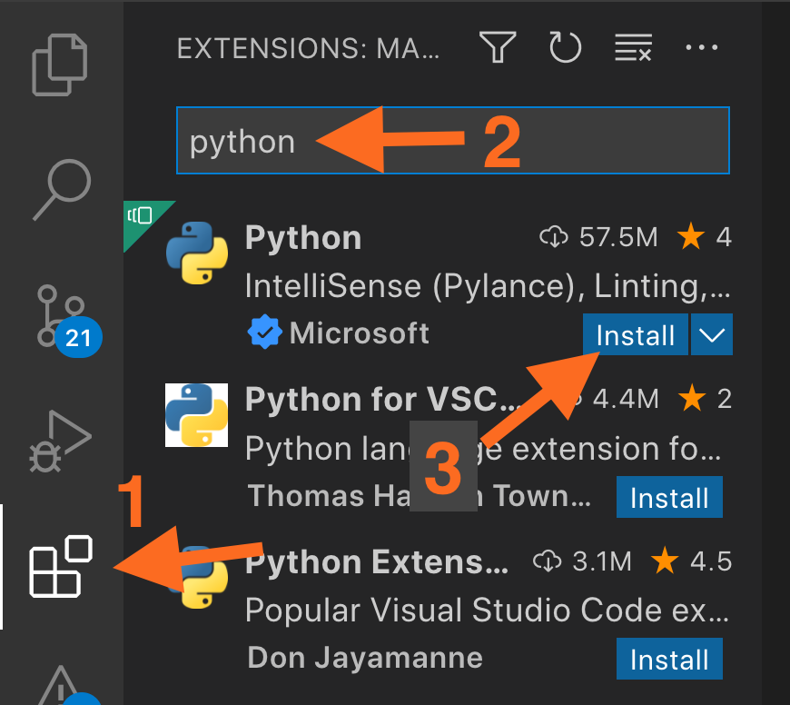

## Linking your virtual environment

### 1. Select the Python interpreter from the bottom toolbar

   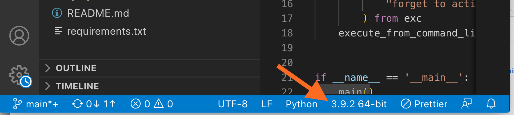

### 2. Enter the location of your Python interpreter in your virtual environment

   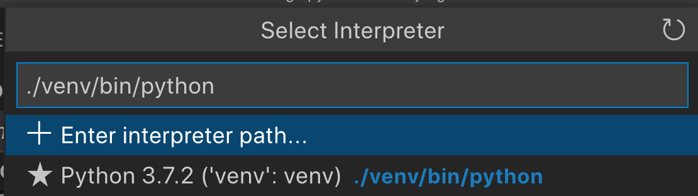

On Windows, this will be `.\venv\Scripts\python.exe`

## Set up a run configuration file

### 1. Go to the **Run and Debug** view

   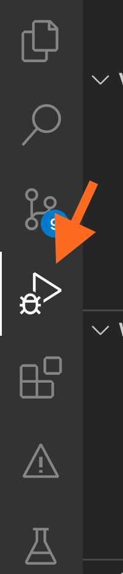

### 2. Create a `launch.json` file

   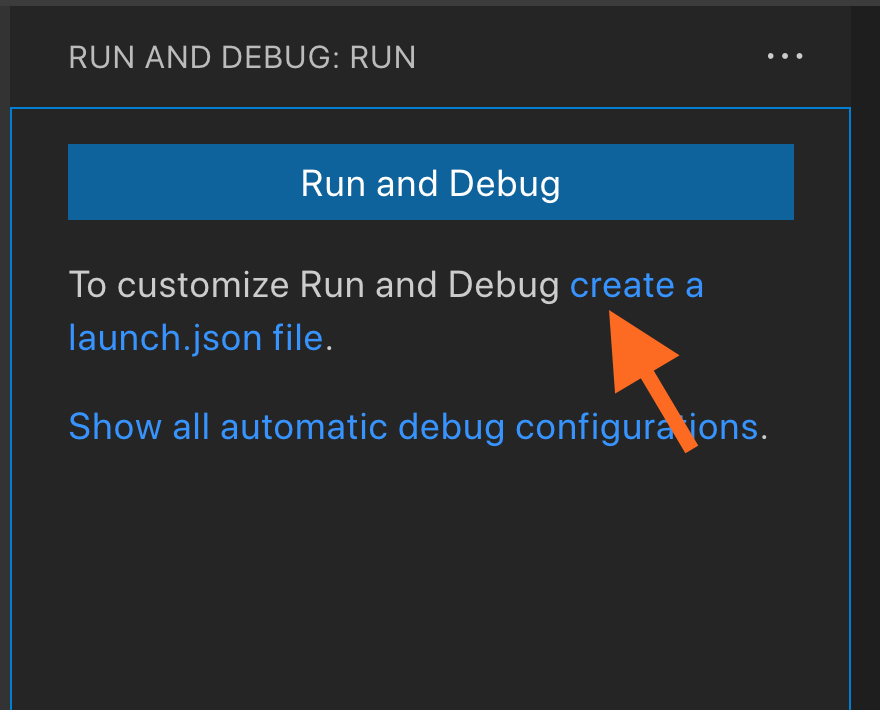

### 3. Select Django

   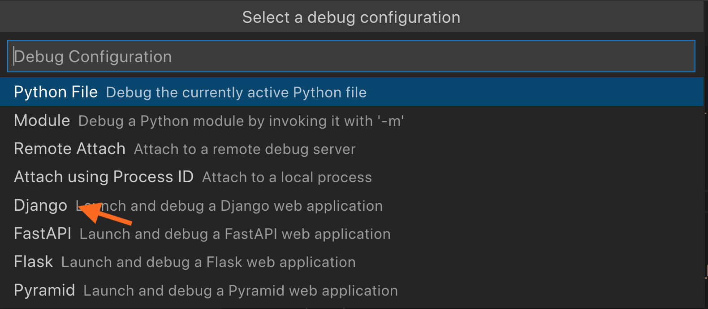

### 4. Enter the path to `manage.py`

   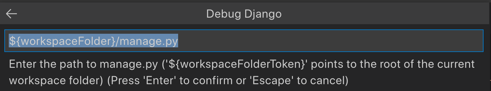

For our sample project, it will be `${workspaceFolder}/trivia_site/manage.py`

   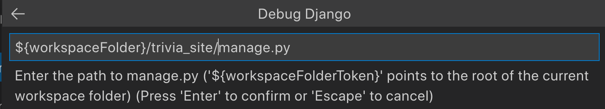

Hit Enter

### 5. Review `launch.json` settings

   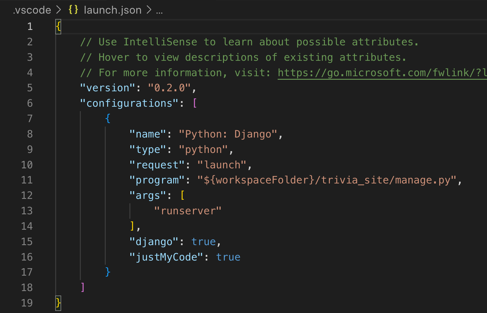

You can always go back here to edit your run configuration settings.

Notice that `"args"` contains `"runserver"`, since you normally run the command `python manage.py runserver`.

### 6. Run the development server

   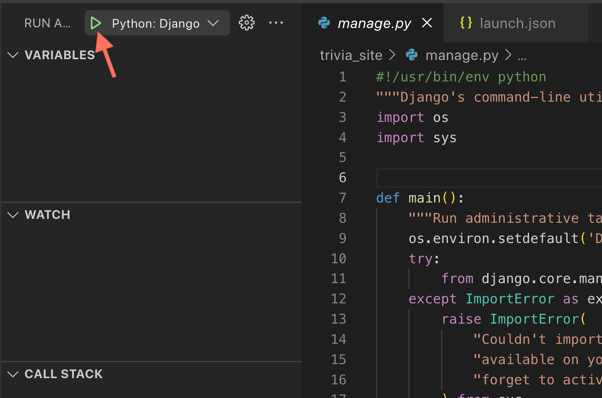

Now you can click on the run button to use the Django settings you've just configured.

### 7. Switch between consoles in the right sidebar

   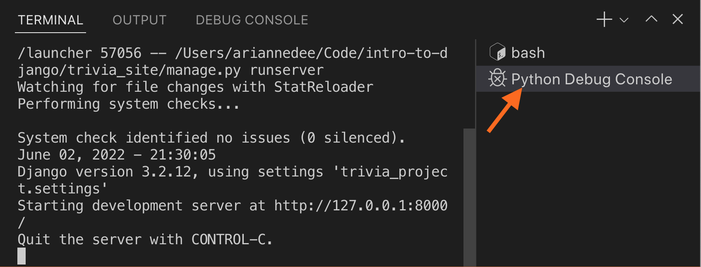

This will run the development server in the terminal in a tab called Python Debug Console.

Navigate to the **bash** tab to get back to your Terminal console.

## Debugging

### 1. Run the development server using the Django configuration

Follow the steps above to run Django in debug mode

   

### 2. Set breakpoints in your code

   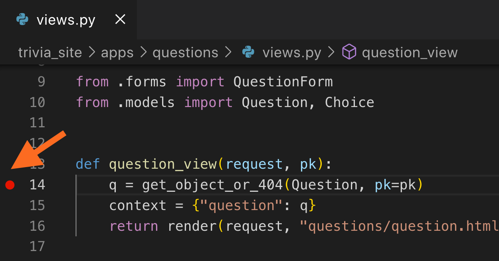

### 3. Debug using the debugger

   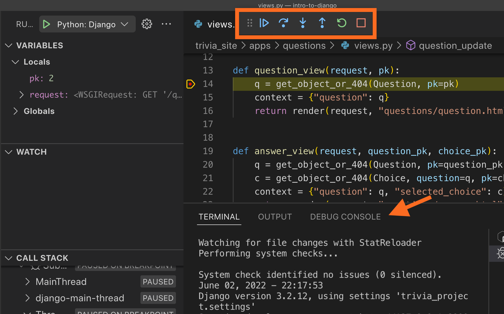

Use the buttons at the top to debug your code from the current breakpoint.

Navigate to the **Debug Console** tab at the bottom to get to evaluate expressions in your current debugger context.

